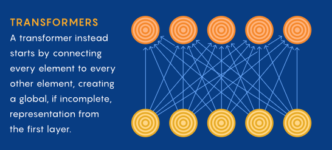

</img>

<sub>*<a href="https://d2l.ai/chapter_attention-mechanisms/self-attention-and-positional-encoding.html">Dive into Deep Learning</a>, redone by Quanta Magazine*</sub>

## Flash Cosine Similarity Attention

Implementation of fused cosine similarity attention in the same style as <a href="https://arxiv.org/abs/2205.14135">Flash Attention</a>. The observation is that by adopting l2 normalized queries and keys, you no longer need to keep track of the row maximums for numerical stability. This greatly simplifies the flash attention algorithm, assuming cosine similarity attention comes at no generalization cost.

In other words, stable, fast, memory efficient, and longer context attention with no downsides.

## Status (wip)

At the moment, autoregressive and variable lengthed sequences should be faster across all architectures. For sequences longer than 2048, it will also be memory efficient where regular attention would not.

However, for non-autoregressive without masking, the architecture is still slower on A100 for F16. The aim is to get it to perform faster on A100 forwards and backwards for both F32 and F16, as shared memory is not fully exploited yet.

Older graphic cards without enough shared memory, one will have to gauge the tradeoff of memory efficiency and speed depending on the sequence length being trained at.

## Appreciation

- <a href="https://github.com/ahennequ">Arthur Hennequin</a> for coaching me through my first CUDA kernel, and for coding up a simple <a href="https://github.com/ahennequ/pytorch-custom-mma">reference implementation</a>, which helped me to bootstrap the first kernel that comes within reasonable performance to baseline. This work would not have been possible without his expertise.

- <a href="https://github.com/borisdayma">Boris Dayma</a> and <a href="https://github.com/rromb">Robin Rombach</a> for running experiments the simplified cosine sim attention with fixed scaling on some significant text-to-image models and verifying that it indeeds perform just as well as regular attention.

- <a href="https://github.com/MarkusRabe">Markus Rabe</a> for penning the paper that showed <a href="https://arxiv.org/abs/2112.05682">attention does not require O(n²) memory</a>, and <a href="https://tridao.me/">Tri Dao</a> for putting it all together in <a href="https://github.com/HazyResearch/flash-attention">a CUDA kernel implementation for regular attention</a>, demonstrating superiority in speed using the tiled approach minimizing HBM accesses (and for figuring out `dO * O == dP * P` for backwards pass). Would not have been able to complete my pilgrimage looking for the ultimate attention formulation without their discoveries.

- <a href="https://stability.ai/">Stability.ai</a> for the generous sponsorship to work on cutting edge artificial intelligence research

## Install

```bash
$ pip install flash-cosine-sim-attention
```

## Usage

Self Attention

```python
import torch
from flash_cosine_sim_attention import flash_cosine_sim_attention

q = torch.randn(1, 8, 1024, 64).cuda()
k = torch.randn(1, 8, 1024, 64).cuda()
v = torch.randn(1, 8, 1024, 64).cuda()

out = flash_cosine_sim_attention(q, k, v)  # (1, 8, 1024, 64)
```

Cross attention

```python
import torch
from flash_cosine_sim_attention import flash_cosine_sim_attention

q = torch.randn(1, 8, 1024, 64).cuda()
k = torch.randn(1, 8, 2048, 64).cuda()
v = torch.randn(1, 8, 2048, 64).cuda()

out = flash_cosine_sim_attention(q, k, v) # (1, 8, 1024, 64)
```

With key / value masking

```python
import torch
from flash_cosine_sim_attention import flash_cosine_sim_attention

q = torch.randn(1, 8, 1024, 64).cuda()
k = torch.randn(1, 8, 2048, 64).cuda()
v = torch.randn(1, 8, 2048, 64).cuda()

mask = torch.ones(1, 2048).bool().cuda()

out = flash_cosine_sim_attention(q, k, v, mask = mask) # (1, 8, 1024, 64)
```

Autoregressive

```python
import torch
from flash_cosine_sim_attention import flash_cosine_sim_attention

q = torch.randn(4, 8, 1024, 64).cuda()
k = torch.randn(4, 8, 1024, 64).cuda()
v = torch.randn(4, 8, 1024, 64).cuda()

out = flash_cosine_sim_attention(q, k, v, causal = True)  # (4, 8, 1024, 64)
```

## Miscellaneous

Single-headed key / values (Shazeer et al & used in PaLM)

```python
import torch
from flash_cosine_sim_attention import flash_cosine_sim_attention

q = torch.randn(4, 8, 1024, 64).cuda()
k = torch.randn(4, 1024, 64).cuda()
v = torch.randn(4, 1024, 64).cuda()

out = flash_cosine_sim_attention(q, k, v, causal = True)  # (4, 8, 1024, 64)
```

If you need to do operations on the queries and keys in between the l2norm and the actual attention step, just set `l2norm_qk = False`

ex.

```python
import torch
from flash_cosine_sim_attention import flash_cosine_sim_attention, l2norm_tensors

q = torch.randn(4, 8, 1024, 64).cuda()
k = torch.randn(4, 1024, 64).cuda()
v = torch.randn(4, 1024, 64).cuda()

q, k = l2norm_tensors(q, k)

# do your rotation of queries and keys
# say with https://github.com/lucidrains/rotary-embedding-torch

out = flash_cosine_sim_attention(q, k, v, l2norm_qk = False)  # (4, 8, 1024, 64)
```

Cross attention with causal works as expected - (caching of keys and values in autoregressive during inference, or transformer-xl like training)

```python
import torch
from flash_cosine_sim_attention import flash_cosine_sim_attention

q = torch.randn(1, 8, 1024, 64).cuda()
k = torch.randn(1, 8, 2048, 64).cuda()
v = torch.randn(1, 8, 2048, 64).cuda()

out = flash_cosine_sim_attention(q, k, v, causal = True) # (1, 8, 1024, 64)
```

If you have batch and head dimensions merged, that is ok

```python
import torch
from flash_cosine_sim_attention import flash_cosine_sim_attention

q = torch.randn(32, 1024, 64).cuda()
k = torch.randn(32, 2048, 64).cuda()
v = torch.randn(32, 2048, 64).cuda()

out = flash_cosine_sim_attention(q, k, v, causal = True) # (32, 1024, 64)
```

## Supported head dimensions

- [x] 16 - f32
- [x] 32
- [x] 64
- [x] 96
- [x] 128

- [ ] 16 -f16
- [ ] 80 - in progress

## Todo

- [ ] prepare a smem fragment caching mechanism, to allow for as much caching as allowed on A100 (or f16). also allow for transposed access to smem data
- [ ] bfloat16 support, use sfinae as recommended by Arthur
- [ ] stream from qk_mma to shared memory in chunks to calculate out mma, see if freed smem can be used for caching more
- [ ] think about use of logsumexp
- [ ] support O(n) 1d dynamic positional bias

- [x] make attention tile size processing customizable for backwards pass
- [x] move atomic add to overloaded function inside mma
- [x] flexible which type is used for accumulation
- [x] test out 64x96 tiles on f16
- [x] bring in a CPU memory efficient version (only for inference, as training does not make sense) using just plain pytorch code
- [x] figure out how to dispatch differently for architectures (say A100), in case backwards can make use of the increase in shared memory differently
- [x] decouple row and column sizes for attention tiles
- [x] dk and dv are now in f16 when it can be (non single headed kv)
- [x] support more standard head dimensions (wip)
- [x] debug and fix bias backwards gradients yet again for head size of 32
- [x] fix attention bias gradients
- [x] allow for single-headed key / values, as in PaLM
- [x] fix atomic add for f16
- [x] attention bias should be able to accept dimensions of an extra batch dimension, for Alphafold2 like attention biasing
- [x] automate cache-busting of kernel using version as suffix to package name
- [x] resolve f16 causal numerical issues
- [x] adopt all learnings from forward kernel to backwards kernel and make sure it outperforms at least on A100

## Description

So far cosine similarity attention is not widely used in industry. The only large model that has been trained with it so far is <a href="https://arxiv.org/abs/2111.09883">SwinV2</a>. If anyone can invalidate the approach, please open an issue or send me an email. You can run experiments against regular attention using the <a href="https://github.com/lucidrains/x-transformers#grouped-query-key-l2-normalization">x-transformers</a> repository.

Update: <a href="https://github.com/borisdayma">Boris Dayma</a> has graciously kicked off <a href="https://wandb.ai/dalle-mini/dalle-mini/reports/Fix-Swin-v2--VmlldzoyNDA4Mzc3">an experiment (blue with red as baseline)</a> to validate cosine similarity attention with a fixed scale of 10 in a real-world model setting. 🙏

Update 2: Cosine similarity attention has been proven out in a real-world text-to-image attention network, using a constant scale of `10`. No worse than regular attention. Credit goes to <a href="https://github.com/borisdayma">Boris Dayma</a> for investing the time to run the experiment and removing doubts surrounding the technique.

Update 3: <a href="https://github.com/rromb">Robin Rombach</a> has tested out the kernel in this repository with head size of 64 and fixed scale of 10 in a text-to-image model, observing no difference from regular attention. More evaluations pending.

Update 4: The improvement in performance seen in Boris' experiments are likely due to the fact that cosine-sim attention allows for one to switch from pre layernorm to post layernorm configuration in the transformers (as the l2norm effectively takes the place of the pre-layernorm). Cosine sim attention will likely yield results the same as regular attention, without any other changes to the transformer.

## Testing

For testing output and gradients are equal for non-autoregressive and autoregressive scenarios

```bash
$ python setup.py test
```

## Benchmarking

Make sure to first install the CUDA kernel

```python
$ python setup.py install
```

Then

```python
$ python benchmark.py
```

For only benchmarking forwards or backwards, append either `--only-forwards` or `--only-backwards` flag to the above. To benchmark autoregressive, append `--causal`

## Benchmarks - wip

### GTX 2080 Ti

Forward

```bash
------------------------------------------------------------
float32     batch: 4    heads: 8    dim 64
------------------------------------------------------------
seq_len: 128    slower: 1.05x   kernel: 0.24ms  baseline: 0.23ms
seq_len: 256    slower: 1.27x   kernel: 0.38ms  baseline: 0.30ms
seq_len: 512    slower: 1.28x   kernel: 0.87ms  baseline: 0.68ms
seq_len: 1024   slower: 1.15x   kernel: 2.63ms  baseline: 2.28ms
seq_len: 2048   slower: 0.99x   kernel: 7.99ms  baseline: 8.10ms
seq_len: 4096   slower: 0.88x   kernel: 30.82ms baseline: 34.84ms
seq_len: 8192   slower: 0.00x   kernel: 121.96ms    baseline: oom
------------------------------------------------------------
float16     batch: 4    heads: 8    dim 64
------------------------------------------------------------
seq_len: 128    slower: 0.85x   kernel: 0.20ms  baseline: 0.24ms
seq_len: 256    slower: 0.97x   kernel: 0.24ms  baseline: 0.25ms
seq_len: 512    slower: 1.22x   kernel: 0.43ms  baseline: 0.35ms
seq_len: 1024   slower: 0.95x   kernel: 0.93ms  baseline: 0.98ms
seq_len: 2048   slower: 0.90x   kernel: 3.16ms  baseline: 3.50ms
seq_len: 4096   slower: 0.85x   kernel: 11.06ms baseline: 13.07ms
seq_len: 8192   slower: 0.00x   kernel: 42.61ms baseline: oom
```

Backwards - still needs work

```bash
------------------------------------------------------------
float32     batch: 4    heads: 8    dim 64
------------------------------------------------------------
seq_len: 128    slower: 1.07x   kernel: 0.61ms  baseline: 0.57ms
seq_len: 256    slower: 1.40x   kernel: 0.91ms  baseline: 0.65ms
seq_len: 512    slower: 1.70x   kernel: 2.34ms  baseline: 1.38ms
seq_len: 1024   slower: 1.26x   kernel: 5.67ms  baseline: 4.50ms
seq_len: 2048   slower: 1.29x   kernel: 20.60ms baseline: 15.91ms
seq_len: 4096   slower: 1.30x   kernel: 78.93ms baseline: 60.81ms
seq_len: 8192   slower: 0.00x   kernel: 314.51ms    baseline: oom
------------------------------------------------------------
float16     batch: 4    heads: 8    dim 64
------------------------------------------------------------
seq_len: 128    slower: 0.91x   kernel: 0.50ms  baseline: 0.55ms
seq_len: 256    slower: 1.06x   kernel: 0.58ms  baseline: 0.55ms
seq_len: 512    slower: 1.13x   kernel: 0.81ms  baseline: 0.72ms
seq_len: 1024   slower: 0.97x   kernel: 2.09ms  baseline: 2.16ms
seq_len: 2048   slower: 0.96x   kernel: 7.06ms  baseline: 7.35ms
seq_len: 4096   slower: 0.97x   kernel: 26.08ms baseline: 26.84ms
seq_len: 8192   slower: 0.00x   kernel: 101.02ms    baseline: oom
```

Forward & Backwards - F32 is definitely slower

```bash
------------------------------------------------------------
float32     batch: 4    heads: 8    dim 64  
------------------------------------------------------------
seq_len: 128    slower: 1.05x   kernel: 0.83ms  baseline: 0.79ms
seq_len: 256    slower: 1.34x   kernel: 1.26ms  baseline: 0.95ms
seq_len: 512    slower: 1.44x   kernel: 3.14ms  baseline: 2.18ms
seq_len: 1024   slower: 1.15x   kernel: 7.83ms  baseline: 6.81ms
seq_len: 2048   slower: 1.20x   kernel: 28.83ms baseline: 24.03ms
seq_len: 4096   slower: 1.20x   kernel: 111.13ms    baseline: 92.51ms
seq_len: 8192   slower: 0.00x   kernel: 441.70ms    baseline: oom
------------------------------------------------------------
float16     batch: 4    heads: 8    dim 64  
------------------------------------------------------------
seq_len: 128    slower: 0.89x   kernel: 0.68ms  baseline: 0.77ms
seq_len: 256    slower: 1.03x   kernel: 0.80ms  baseline: 0.77ms
seq_len: 512    slower: 1.06x   kernel: 1.16ms  baseline: 1.10ms
seq_len: 1024   slower: 0.93x   kernel: 2.94ms  baseline: 3.16ms
seq_len: 2048   slower: 0.93x   kernel: 10.06ms baseline: 10.87ms
seq_len: 4096   slower: 0.93x   kernel: 37.09ms baseline: 39.96ms
seq_len: 8192   slower: 0.00x   kernel: 143.13ms    baseline: oom
```

For autoregressive, a clear win `python benchmark.py --causal`

```bash
------------------------------------------------------------
float32     batch: 4    heads: 8    dim 64  
------------------------------------------------------------
seq_len: 128    slower: 0.97x   kernel: 0.81ms  baseline: 0.84ms
seq_len: 256    slower: 1.07x   kernel: 1.12ms  baseline: 1.05ms
seq_len: 512    slower: 0.83x   kernel: 2.23ms  baseline: 2.68ms
seq_len: 1024   slower: 0.55x   kernel: 4.83ms  baseline: 8.82ms
seq_len: 2048   slower: 0.49x   kernel: 15.89ms baseline: 32.68ms
seq_len: 4096   slower: 0.46x   kernel: 57.50ms baseline: 126.00ms
seq_len: 8192   slower: 0.00x   kernel: 224.76ms    baseline: oom
------------------------------------------------------------
float16     batch: 4    heads: 8    dim 64  
------------------------------------------------------------
seq_len: 128    slower: 0.82x   kernel: 0.69ms  baseline: 0.84ms
seq_len: 256    slower: 0.95x   kernel: 0.79ms  baseline: 0.83ms
seq_len: 512    slower: 0.78x   kernel: 1.06ms  baseline: 1.37ms
seq_len: 1024   slower: 0.50x   kernel: 2.10ms  baseline: 4.24ms
seq_len: 2048   slower: 0.37x   kernel: 5.85ms  baseline: 15.92ms
seq_len: 4096   slower: 0.31x   kernel: 19.80ms baseline: 64.42ms
seq_len: 8192   slower: 0.00x   kernel: 75.25ms baseline: oom

```

For variable length sequences with masking, also a clear win. Assume on average 25% of tokens masked out `python benchmark.py --mask-prob 0.25`

```bash
------------------------------------------------------------
float32     batch: 4    heads: 8    dim 64
------------------------------------------------------------
seq_len: 128    slower: 0.95x   kernel: 0.84ms  baseline: 0.89ms
seq_len: 256    slower: 1.19x   kernel: 1.28ms  baseline: 1.08ms
seq_len: 512    slower: 1.23x   kernel: 3.19ms  baseline: 2.59ms
seq_len: 1024   slower: 0.92x   kernel: 8.19ms  baseline: 8.88ms
seq_len: 2048   slower: 0.92x   kernel: 30.08ms baseline: 32.57ms
seq_len: 4096   slower: 0.94x   kernel: 123.20ms    baseline: 131.22ms
seq_len: 8192   slower: 0.00x   kernel: 461.77ms    baseline: oom
------------------------------------------------------------
float16     batch: 4    heads: 8    dim 64
------------------------------------------------------------
seq_len: 128    slower: 0.85x   kernel: 0.77ms  baseline: 0.90ms
seq_len: 256    slower: 0.93x   kernel: 0.86ms  baseline: 0.93ms
seq_len: 512    slower: 0.93x   kernel: 1.31ms  baseline: 1.40ms
seq_len: 1024   slower: 0.76x   kernel: 3.31ms  baseline: 4.35ms
seq_len: 2048   slower: 0.71x   kernel: 11.19ms baseline: 15.65ms
seq_len: 4096   slower: 0.70x   kernel: 41.27ms baseline: 59.01ms
seq_len: 8192   slower: 0.00x   kernel: 158.60ms    baseline: oom
```

### A100 40GB (wip)

Thanks goes out to <a href="https://stability.ai/">Stability</a> for providing access to A100s for testing. Thanks to <a href="https://github.com/conceptofmind">Enrico</a> for taking the time to run some benchmarks when I had no access yet.

A100 is still a work in progress. Shared memory is not fully exploited yet. Strangely enough, F32 seems to be doing better than F16

####

Forwards

```bash
------------------------------------------------------------
float32     batch: 4    heads: 8    dim 64
------------------------------------------------------------
seq_len: 128    slower: 0.98x   kernel: 0.29ms  baseline: 0.30ms
seq_len: 256    slower: 1.19x   kernel: 0.35ms  baseline: 0.29ms
seq_len: 512    slower: 0.94x   kernel: 0.52ms  baseline: 0.55ms
seq_len: 1024   slower: 0.75x   kernel: 1.23ms  baseline: 1.65ms
seq_len: 2048   slower: 0.88x   kernel: 4.17ms  baseline: 4.73ms
seq_len: 4096   slower: 0.79x   kernel: 14.53ms baseline: 18.36ms
seq_len: 8192   slower: 0.64x   kernel: 55.01ms baseline: 85.93ms
------------------------------------------------------------
float16     batch: 4    heads: 8    dim 64
------------------------------------------------------------
seq_len: 128    slower: 0.84x   kernel: 0.24ms  baseline: 0.29ms
seq_len: 256    slower: 1.02x   kernel: 0.29ms  baseline: 0.29ms
seq_len: 512    slower: 1.24x   kernel: 0.36ms  baseline: 0.29ms
seq_len: 1024   slower: 1.48x   kernel: 0.79ms  baseline: 0.54ms
seq_len: 2048   slower: 1.31x   kernel: 2.08ms  baseline: 1.59ms
seq_len: 4096   slower: 1.21x   kernel: 6.89ms  baseline: 5.70ms
seq_len: 8192   slower: 1.07x   kernel: 24.80ms baseline: 23.15ms
```

Backwards

```bash
------------------------------------------------------------
float32     batch: 4    heads: 8    dim 64
------------------------------------------------------------
seq_len: 128    slower: 0.94x   kernel: 0.57ms  baseline: 0.60ms
seq_len: 256    slower: 1.29x   kernel: 0.75ms  baseline: 0.58ms
seq_len: 512    slower: 1.16x   kernel: 1.30ms  baseline: 1.12ms
seq_len: 1024   slower: 0.98x   kernel: 3.14ms  baseline: 3.19ms
seq_len: 2048   slower: 1.05x   kernel: 11.13ms baseline: 10.63ms
seq_len: 4096   slower: 0.98x   kernel: 40.11ms baseline: 40.79ms
seq_len: 8192   slower: 0.97x   kernel: 154.96ms    baseline: 159.70ms
------------------------------------------------------------
float16     batch: 4    heads: 8    dim 64
------------------------------------------------------------
seq_len: 128    slower: 0.91x   kernel: 0.55ms  baseline: 0.60ms
seq_len: 256    slower: 1.03x   kernel: 0.62ms  baseline: 0.60ms
seq_len: 512    slower: 1.36x   kernel: 0.82ms  baseline: 0.60ms
seq_len: 1024   slower: 1.52x   kernel: 1.52ms  baseline: 1.01ms
seq_len: 2048   slower: 1.37x   kernel: 4.14ms  baseline: 3.03ms
seq_len: 4096   slower: 1.33x   kernel: 14.23ms baseline: 10.71ms
seq_len: 8192   slower: 1.34x   kernel: 53.90ms baseline: 40.28ms
````

Forwards & Backwards

```bash
------------------------------------------------------------
float32     batch: 4    heads: 8    dim 64
------------------------------------------------------------
seq_len: 128    slower: 0.92x   kernel: 0.80ms  baseline: 0.87ms
seq_len: 256    slower: 1.23x   kernel: 1.07ms  baseline: 0.87ms
seq_len: 512    slower: 1.08x   kernel: 1.80ms  baseline: 1.66ms
seq_len: 1024   slower: 0.94x   kernel: 4.33ms  baseline: 4.62ms
seq_len: 2048   slower: 0.99x   kernel: 15.26ms baseline: 15.44ms
seq_len: 4096   slower: 0.93x   kernel: 54.78ms baseline: 59.21ms
seq_len: 8192   slower: 0.91x   kernel: 210.38ms    baseline: 230.97ms
------------------------------------------------------------
float16     batch: 4    heads: 8    dim 64
------------------------------------------------------------
seq_len: 128    slower: 0.90x   kernel: 0.78ms  baseline: 0.86ms
seq_len: 256    slower: 1.00x   kernel: 0.87ms  baseline: 0.87ms
seq_len: 512    slower: 1.36x   kernel: 1.18ms  baseline: 0.86ms
seq_len: 1024   slower: 1.49x   kernel: 2.31ms  baseline: 1.55ms
seq_len: 2048   slower: 1.33x   kernel: 6.17ms  baseline: 4.63ms
seq_len: 4096   slower: 1.28x   kernel: 21.08ms baseline: 16.44ms
seq_len: 8192   slower: 1.24x   kernel: 78.75ms baseline: 63.45ms
```

Autoregressive

```bash
------------------------------------------------------------
float32     batch: 4    heads: 8    dim 64  
------------------------------------------------------------
seq_len: 128    slower: 0.82x   kernel: 0.82ms  baseline: 1.01ms
seq_len: 256    slower: 1.02x   kernel: 1.00ms  baseline: 0.98ms
seq_len: 512    slower: 0.82x   kernel: 1.55ms  baseline: 1.89ms
seq_len: 1024   slower: 0.51x   kernel: 2.79ms  baseline: 5.44ms
seq_len: 2048   slower: 0.45x   kernel: 8.37ms  baseline: 18.67ms
seq_len: 4096   slower: 0.40x   kernel: 29.16ms baseline: 72.97ms
seq_len: 8192   slower: 0.38x   kernel: 108.68ms    baseline: 285.47ms
------------------------------------------------------------
float16     batch: 4    heads: 8    dim 64  
------------------------------------------------------------
seq_len: 128    slower: 0.82x   kernel: 0.81ms  baseline: 0.98ms
seq_len: 256    slower: 0.90x   kernel: 0.88ms  baseline: 0.98ms
seq_len: 512    slower: 1.16x   kernel: 1.13ms  baseline: 0.97ms
seq_len: 1024   slower: 0.80x   kernel: 1.68ms  baseline: 2.10ms
seq_len: 2048   slower: 0.54x   kernel: 3.66ms  baseline: 6.81ms
seq_len: 4096   slower: 0.45x   kernel: 11.43ms baseline: 25.32ms
seq_len: 8192   slower: 0.41x   kernel: 40.58ms baseline: 99.14ms
```

Variable lengthed sequences (up to 25% tokens masked out)

```bash
------------------------------------------------------------
float32     batch: 4    heads: 8    dim 64  
------------------------------------------------------------
seq_len: 128    slower: 0.80x   kernel: 0.85ms  baseline: 1.07ms
seq_len: 256    slower: 1.07x   kernel: 1.15ms  baseline: 1.08ms
seq_len: 512    slower: 1.00x   kernel: 1.94ms  baseline: 1.94ms
seq_len: 1024   slower: 0.84x   kernel: 4.64ms  baseline: 5.55ms
seq_len: 2048   slower: 0.84x   kernel: 15.86ms baseline: 18.86ms
seq_len: 4096   slower: 0.76x   kernel: 55.19ms baseline: 72.47ms
seq_len: 8192   slower: 0.75x   kernel: 212.48ms    baseline: 282.71ms
------------------------------------------------------------
float16     batch: 4    heads: 8    dim 64  
------------------------------------------------------------
seq_len: 128    slower: 0.80x   kernel: 0.83ms  baseline: 1.04ms
seq_len: 256    slower: 0.90x   kernel: 0.93ms  baseline: 1.03ms
seq_len: 512    slower: 1.18x   kernel: 1.22ms  baseline: 1.04ms
seq_len: 1024   slower: 1.10x   kernel: 2.40ms  baseline: 2.17ms
seq_len: 2048   slower: 0.89x   kernel: 6.27ms  baseline: 7.06ms
seq_len: 4096   slower: 0.82x   kernel: 21.19ms baseline: 25.95ms
seq_len: 8192   slower: 0.78x   kernel: 79.45ms baseline: 101.83ms
```

## Training a small GPT on Enwik8

```bash
$ make train
```

Try 8192 sequence length. It'll be slow but will work (normal attention will break at > 2048, you'll see this if you remove the `--use-cuda-kernel` flag)

```python
$ python train.py --seq-len 8192 --use-cuda-kernel
```

## Citations

```bibtex
@article{Dao2022FlashAttentionFA,
    title   = {FlashAttention: Fast and Memory-Efficient Exact Attention with IO-Awareness},
    author  = {Tri Dao and Daniel Y. Fu and Stefano Ermon and Atri Rudra and Christopher R'e},
    journal = {ArXiv},
    year    = {2022},
    volume  = {abs/2205.14135}
}
```

```bibtex
@misc{rabe2021selfattention,
    title   = {Self-attention Does Not Need $O(n^2)$ Memory}, 
    author  = {Markus N. Rabe and Charles Staats},
    year    = {2021},
    eprint  = {2112.05682},
    archivePrefix = {arXiv},
    primaryClass = {cs.LG}
}
```

```bibtex
@inproceedings{Henry2020QueryKeyNF,
    title   = {Query-Key Normalization for Transformers},
    author  = {Alex Henry and Prudhvi Raj Dachapally and Shubham Vivek Pawar and Yuxuan Chen},
    booktitle = {FINDINGS},
    year    = {2020}
}
```

```bibtex
@article{Wang2022DeepNetST,
    title   = {DeepNet: Scaling Transformers to 1, 000 Layers},
    author  = {Hongyu Wang and Shuming Ma and Li Dong and Shaohan Huang and Dongdong Zhang and Furu Wei},
    journal = {ArXiv},
    year    = {2022},
    volume  = {abs/2203.00555}
}
```
